 

<picture>
  <source media="(prefers-color-scheme: dark)" srcset="https://raw.githubusercontent.com/AceBreaker-Cell/AceBreaker-Cell/output/pacman-contribution-graph-dark.svg">
  <source media="(prefers-color-scheme: light)" srcset="https://raw.githubusercontent.com/AceBreaker-Cell/AceBreaker-Cell/output/pacman-contribution-graph.svg">
  
</picture>

  

  

<b>Click to know more about me! 👀</b>

 

#### `$ whoami`

 

#### Stack

  

#### 🎧 last.fm feed

 

  

#### 📊 github stats

  

 

